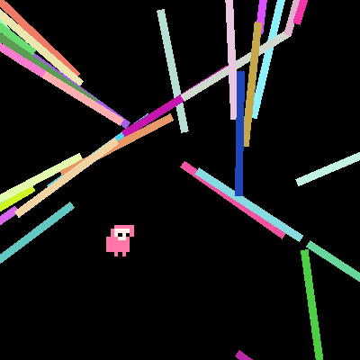

# lase



An extremely WIP experiment using the Amethyst game engine.

Particular effort is made to have good documentation at all levels of development, with the specific goal of being useful as an example base of code. Portions of code I suspect to be non-idiomatic are marked as such, and close attention is being paid to correctness, style, and hygiene.

## Running

Depending on your operating system, you will need to specify different rendering backends. On Windows and Linux, use

```
cargo run --features "vulkan"
```

and on macOS use

```
cargo run --features "metal"
```

Convenience wrapper scripts around the `vulkan` feature are located in the repository root.
